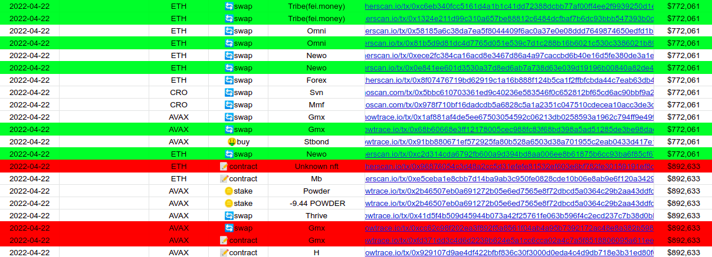
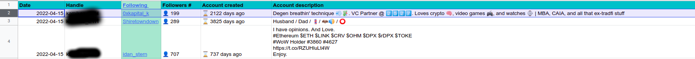

```
  ___      _               _     _____        _ _   _             ___      _               
 |   \ ___| |__  __ _ _ _ | |__ |_   _|_ __ _(_) |_| |_ ___ _ _  / __|_ _ (_)_ __  ___ _ _ 
 | |) / -_) '_ \/ _` | ' \| / /   | | \ V  V / |  _|  _/ -_) '_| \__ \ ' \| | '_ \/ -_) '_|
 |___/\___|_.__/\__,_|_||_|_\_\   |_|  \_/\_/|_|\__|\__\___|_|   |___/_||_|_| .__/\___|_|  
                                                                            |_|                    
```

### What is it ? ###

Dear anon, Debank Twitter Sniper is a PoC tool that identifies new opportunities by: 
- watching wallets you specify on **31 blockchains** (as the time of writing)
- sniping new Twitter followings from accounts you choose in an easy-to-read format

It tracks:
- 🖼️ mints
- 🪙 stakes / 💸 unstakes
- 🤑 buys  
- 🔄 swaps
- 📝 contract interactions 

I've opensourced this proof-of-concept because I don't have time to make it evolve/improve it.

I'm currently learning Solidity, EVM and want to land a job in a web3 company after that.

Another challenge: participating in MEV in the future as a personal challenge.

### What sets it apart ? ###

- New tokens interactions are written in a dedicated sheet to find new opportunities
- different colors to highlight:
  - repeated buys of token X from same wallet (green)
  - repeated buys of token X from other wallets you track (red)
- clean UI
- easy filtering (Google Sheet -> CSV format)
- it adapts to new blockchains being added since it will scrape Debank to gather wallets activity.

**Screenshots below:**

Debank Wallet Sniper (wallet names are not shown)



Twitter followings Sniper



### Prerequisites ###

- PHP 8.0+
- Docker-compose
- [Chromedriver](https://chromedriver.chromium.org/) - must be the *same version* as your Chrome browser


### Installation ###
1. [Make a copy of the blank Google Sheet template here](https://docs.google.com/spreadsheets/d/1RbEvgJ4FoDWfwlDonE3ktS7FM5uJkayV4_zpLsfnRO4/edit?usp=sharing)
2. [Create Google service account credentials](https://developers.google.com/workspace/guides/create-credentials#service-account)
3. Download credentials.json and put it in the root project dir
4. Add the email present in credentials.json to the Google Sheet as an admin
5. Make a copy of .env in .env.local and specify the different spreadsheets IDs (you can view the IDs directly in the blank template - ex: 1RbEsgJ4FoDWfwlDonE3ktS7FM5uJkayV4_zpLsfnRq3)
6. Run ```composer install```
7. Run ```/usr/bin/chromedriver --port=1337```
8. Run ```make start```
9. Run ```make init (use Ctrl+D when you have finished to enter output)```

General commands are found in Makefile.

### How to automate this ? ###

By using crons, you can automate the process of finding new opportunities.

Example : 

```
*/10 * * * * /home/YOUR_USER/debank-twitter-sniper/bin/console sniper:snipe >> /home/YOUR_USER/wallet_sniper.log
0 * * * * /home/YOUR_USER/debank-twitter-sniper/bin/console twitter:followings >> /home/YOUR_USER/twitter_followings.log
@reboot /usr/bin/chromedriver --port=1337
```

Use [crontab.guru](https://crontab.guru/) to find the right cron command for your needs.

### TODO (Improvements to make) ###

Feel free to make it better, tailor it to your needs.

Here are some ideas I've thought about:

* use Adapter design pattern to have several data sources to export data to (ie Telegram, Discord...)
* implement auto buy option based on a list of parameters met (example : 2 wallets already bought it, X token is Y% lower than ATH)
* calculate profits per tx for every wallet when applicable
* add a new color when X tx represents Y% of wallet's networth (to highlight conviction bets)
* add a way to export data to a CSV file

### Contact ###

You can contact me directly on [Twitter](https://twitter.com/d3legateCall)

Good luck anon.
